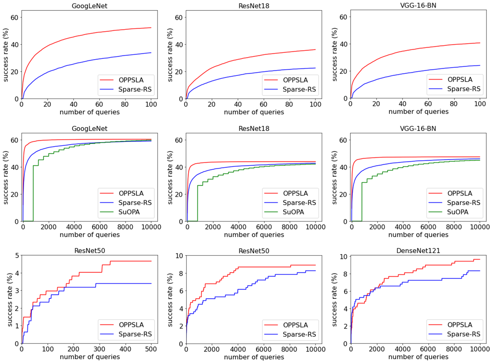

# One Pixel Adversarial Attacks via Sketched Programs
This repository contains the code for the paper [One Pixel Adversarial Attacks via Sketched Programs](https://dl.acm.org/doi/pdf/10.1145/3591301) by Tom Yuviler and Dana Drachsler-Cohen from the Technion, Israel. The paper proposes a novel approach to generate one pixel adversarial attacks with significantly fewer queries to the network by leveraging program synthesis.

## Abstract

Neural networks are successful in various tasks but are also susceptible to adversarial examples. An adversarial
example is generated by adding a small perturbation to a correctly-classified input with the goal of causing
a network classifier to misclassify. In one pixel attacks, an attacker aims to fool an image classifier by
modifying a single pixel. This setting is challenging for two reasons: the perturbation region is very small and
the perturbation is not differentiable. To cope, one pixel attacks iteratively generate candidate adversarial
examples and submit them to the network until finding a successful candidate. However, existing works
require a very large number of queries, which is infeasible in many practical settings, where the attacker
is limited to a few thousand queries to the network. We propose a novel approach for computing one pixel
attacks. The key idea is to leverage program synthesis and identify an expressive program sketch that enables
to compute adversarial examples using significantly fewer queries. We introduce OPPSLA, a synthesizer
that, given a classifier and a training set, instantiates the sketch with customized conditions over the input’s
pixels and the classifier’s output. OPPSLA employs a stochastic search, inspired by the Metropolis-Hastings
algorithm, that synthesizes typed expressions enabling minimization of the number of queries to the classifier.
We further show how to extend OPPSLA to compute few pixel attacks minimizing the number of perturbed
pixels. We evaluate OPPSLA on several deep networks for CIFAR-10 and ImageNet. We show that OPPSLA
obtains a state-of-the-art success rate, often with an order of magnitude fewer queries than existing attacks.
We further show that OPPSLA’s programs are transferable to other classifiers, unlike existing one pixel attacks,
which run from scratch on every classifier and input.

## Usage

This section provides examples of how to utilize OPPSLA for synthesizing one or few pixel adversarial programs, and using these programs to execute an attack on a model.

### Executing a One Pixel Attack on a VGG-16BN Model (CIFAR-10)
In this scenario, we will synthesize a program to perform a one pixel attack on all possible ten classes in a CIFAR-10 VGG-16BN model.

First, run the following command to synthesize the program:
The following are examples of how to use OPPSLA to synthesize one/few pixel adversarial programs, and how to use these programs to attack the model.
```bash
python3 synthesize.py --model "vgg16" --data_set "cifar10" --num_train_images 50 --classes_list 0 1 2 3 4 5 6 7 8 9 --max_iter 210
```
Next, use the generated program to perform the attack:
```bash
python3 attack.py --model "vgg16" --data_set "cifar10" --max_queries 10000 --classes_list 0 1 2 3 4 5 6 7 8 9 --program_path "vgg16_cifar10.pkl" --max_k 1
```

### Executing a One Pixel Attack on a ResNet18 Model (CIFAR-10)
In this example, we will synthesize a program to perform a one pixel attack on the first five classes in a CIFAR-10 ResNet18 model, with a finer granularity of perturbations.

Run the following command to synthesize the program:
```bash
python3 synthesize.py --model "resnet18" --data_set "cifar10" --num_train_images 50 --classes_list 0 1 2 3 4 --max_iter 210 --g 1 --max_g 5
```

And use this command to perform the attack:
```bash
python3 attack.py --model "resnet18" --data_set "cifar10" --max_queries 10000 --classes_list 0 1 2 3 4 --program_path "resnet18_cifar10.pkl" --max_k 1 --g 1 --max_g 5
```

### Executing a Few Pixel Attack on a GoogLeNet Model (CIFAR-10)
Here, we will synthesize a program to perform an attack on a CIFAR-10 GoogLeNet model, with up to '''max_k''' perturbed pixels.

To synthesize the program, run:
```bash
python3 synthesize.py --model "GoogLeNet" --data_set "cifar10" --num_train_images 50 --classes_list 0 1 2 3 4 5 6 7 8 9 --max_iter 210
```

And to execute the attack, use:
```bash
python3 attack.py --model "GoogLeNet" --data_set "cifar10" --max_queries 10000 --classes_list 0 1 2 3 4 5 6 7 8 9 --program_path "GoogLeNet_cifar10.pkl" --max_k 5
```

### Executing a One Pixel Attack on a ResNet50 Model (ImageNet)
Finally, for an example of a one pixel attack on the first four classes of an ImageNet ResNet50 model, use the following commands.

To synthesize the program:
```bash
python3 synthesize.py --model "resnet50" --data_set "imagenet" --num_train_images 10 --classes_list 0 1 2 3 --imagenet_dir "imagenet_train" --mean_norm 0.485 0.456 0.406 --std_norm 0.229 0.224 0.225
```

And to execute the attack, use:
```bash
python3 attack.py --model "resnet50" --data_set "imagenet" --max_queries 10000 --classes_list 0 1 2 3 --program_path "resnet_imagenet.pkl" --max_k 1 --imagenet_dir "imagenet_val"  --mean_norm 0.485 0.456 0.406 --std_norm 0.229 0.224 0.225
```

## Results
 OPPSLA vs. two baselines over one pixel attacks for CIFAR-10 classifiers and ImageNet classifiers:


## Models
CIFAR-10 models adapted from [](http://dx.doi.org/10.5281/zenodo.4431043). 

## Citation

If you find this work useful in your research, please cite:

Tom Yuviler and Dana Drachsler-Cohen. 2023. One Pixel Adversarial Attacks via Sketched Programs. Proc. ACM Program. Lang. 7, PLDI, Article 187 (June 2023), 25 pages. https://doi.org/10.1145/3591301


## License

This project is licensed under the MIT License. See [LICENSE](LICENSE) for more information.
